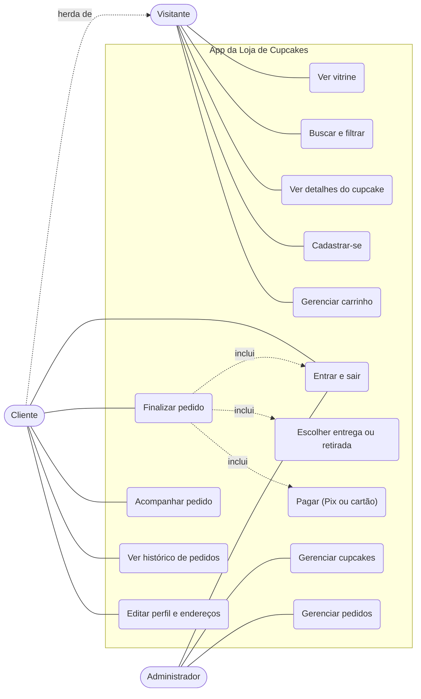

# Tarefas por história e caso de uso geral

**Projeto Integrador Transdisciplinar em Engenharia de Software II**
Continuação de `01-requisitos-agil.md`.

---

## 1. Diagrama de caso de uso geral

O Cliente herda tudo o que o Visitante faz e ainda pode fazer pedidos. Setas pontilhadas com "inclui" mostram passos obrigatórios de outro caso de uso.

| Caso de uso | Histórias relacionadas |
|---|---|
| Ver vitrine / Buscar e filtrar / Ver detalhes | US-04, US-05, US-06 |
| Cadastrar-se / Entrar e sair / Editar perfil | US-01, US-02, US-03 |
| Gerenciar carrinho | US-07, US-08 |
| Escolher entrega ou retirada / Finalizar pedido | US-09, US-10, US-11 |
| Pagar | US-12, US-13 |
| Acompanhar pedido / Ver histórico | US-14, US-15 |
| Gerenciar cupcakes / Gerenciar pedidos | US-16, US-17 |

---

## 2. Tarefas por história (2 a 12 horas cada)

Padrão MVC: **Modelo** (banco e regras), **Controlador** (lógica e rotas), **Visão** (telas) e **Testes**.

| História | Tarefa | Horas |
|---|---|---|
| US-01 | Criar modelo Cliente e tabela | 3 |
| US-01 | Controlador de cadastro com validações (RN01, RN02) e hash de senha | 5 |
| US-01 | Tela de cadastro | 4 |
| US-01 | Escrever testes | 3 |
| US-02 | Controlador de login e logout com sessão | 5 |
| US-02 | Tela de login | 3 |
| US-02 | Escrever testes | 3 |
| US-03 | Criar modelo Endereço e tabela | 2 |
| US-03 | Controlador de perfil e endereços | 6 |
| US-03 | Tela de perfil | 4 |
| US-03 | Escrever testes | 3 |
| US-04 | Criar modelo Cupcake, tabela e dados de exemplo | 3 |
| US-04 | Controlador da vitrine | 3 |
| US-04 | Tela da vitrine responsiva | 6 |
| US-04 | Escrever testes | 2 |
| US-05 | Consulta de busca por nome e filtro por categoria | 4 |
| US-05 | Barra de busca e filtros na tela | 4 |
| US-05 | Escrever testes | 2 |
| US-06 | Controlador de detalhes | 2 |
| US-06 | Tela de detalhes | 4 |
| US-06 | Escrever testes | 2 |
| US-07 | Carrinho guardado na sessão (adicionar item, somar quantidades) | 6 |
| US-07 | Botão "Adicionar" e tela do carrinho | 3 |
| US-07 | Escrever testes | 3 |
| US-08 | Alterar e remover itens, recalcular subtotal | 5 |
| US-08 | Tela do carrinho completa | 5 |
| US-08 | Escrever testes | 3 |
| US-09 | Controlador de entrega/retirada e escolha de endereço | 6 |
| US-09 | Tela de escolha | 4 |
| US-09 | Escrever testes | 3 |
| US-10 | Cálculo da taxa de entrega e do total | 3 |
| US-10 | Exibir resumo com taxa e total | 3 |
| US-10 | Escrever testes | 2 |
| US-11 | Criar modelos Pedido e ItemPedido e tabelas | 5 |
| US-11 | Controlador de finalização com checagem de estoque | 8 |
| US-11 | Tela de resumo do pedido | 4 |
| US-11 | Escrever testes | 4 |
| US-12 | Criar modelo Pagamento e tabela | 3 |
| US-12 | Controlador de pagamento simulado (Pix e cartão) | 8 |
| US-12 | Tela de pagamento | 5 |
| US-12 | Escrever testes | 4 |
| US-13 | Tela de confirmação do pedido | 4 |
| US-13 | Escrever testes | 2 |
| US-14 | Consulta de status e cancelamento (RN09) | 5 |
| US-14 | Tela de acompanhamento | 4 |
| US-14 | Escrever testes | 3 |
| US-15 | Consulta do histórico | 3 |
| US-15 | Tela de lista de pedidos | 3 |
| US-15 | Escrever testes | 2 |
| US-16 | Controlador CRUD de cupcakes (RN03) | 8 |
| US-16 | Telas administrativas | 6 |
| US-16 | Foto do cupcake (por endereço de imagem) | 3 |
| US-16 | Escrever testes | 4 |
| US-17 | Controlador de lista de pedidos e mudança de status (RN08, RN09) | 8 |
| US-17 | Tela do painel de pedidos | 6 |
| US-17 | Escrever testes | 4 |

**Total estimado:** 225 horas.

---

## 3. Sugestão de sprints

| Sprint | Histórias | Horas | Objetivo |
|---|---|---|---|
| 1 | US-04, US-16, US-01, US-02 | 61 | Loja com produtos e acesso de usuários |
| 2 | US-07, US-08, US-09, US-11 | 59 | Carrinho e criação do pedido |
| 3 | US-12, US-17, US-10, US-13 | 52 | Pagamento e gestão de pedidos |
| 4 | US-14, US-06, US-05, US-15, US-03 | 53 | Acompanhamento e melhorias |

Para o PIT II, o essencial é fechar as Sprints 1 a 3 (o fluxo completo de compra). A Sprint 4 entra conforme o tempo.
