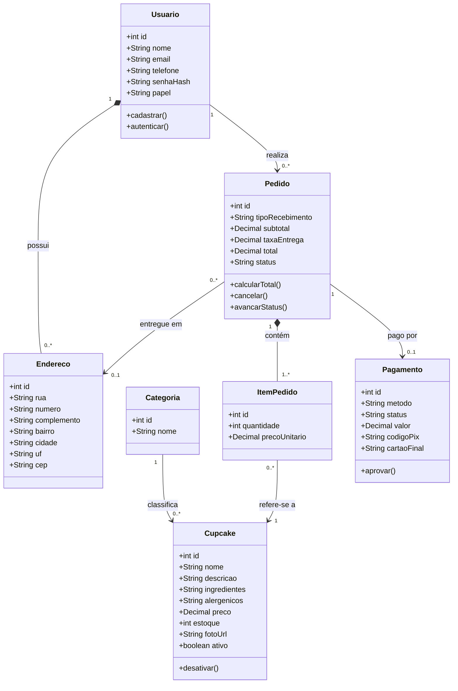

# Modelagem de dados: diagrama de classes, modelo lógico e dicionário de dados

**Projeto Integrador Transdisciplinar em Engenharia de Software II**
O projeto físico (SQL) está em `database/schema.sql` (PostgreSQL).

---

## 1. Diagrama de classes de persistência



**Como ler:** o losango cheio (`*--`) é **composição**, ou seja, a parte não existe sem o todo (um item não existe sem o pedido). A seta simples é **associação**. Os números indicam a cardinalidade (um usuário tem zero ou mais pedidos).

---

## 2. Do diagrama para as tabelas (modelo lógico)

Cada classe vira uma tabela, e cada relação vira uma **chave estrangeira** (FK):

```
usuario(id PK, nome, email UNIQUE, telefone, senha_hash, papel, criado_em)
endereco(id PK, usuario_id FK→usuario, rua, numero, complemento, bairro, cidade, uf, cep)
categoria(id PK, nome UNIQUE)
cupcake(id PK, categoria_id FK→categoria, nome, descricao, ingredientes, alergenicos, preco, estoque, foto_url, ativo)
configuracao(id PK, taxa_entrega)
pedido(id PK, usuario_id FK→usuario, endereco_id FK→endereco, tipo_recebimento, subtotal, taxa_entrega, total, status, criado_em, atualizado_em)
item_pedido(id PK, pedido_id FK→pedido, cupcake_id FK→cupcake, quantidade, preco_unitario)
pagamento(id PK, pedido_id FK→pedido UNIQUE, metodo, status, valor, codigo_pix, cartao_final, criado_em)
```

**Normalização (3FN):** não há dados repetidos nem atributos que dependam de outro atributo que não seja a chave. Exemplos: o nome da categoria fica só em `categoria`, e os itens de um pedido ficam em `item_pedido` (não dentro de `pedido`). O `preco_unitario` no item é uma decisão consciente: guarda o preço da hora da compra, para que mudanças futuras de preço não alterem pedidos antigos.

**Decisões de projeto:**
- **Administrador** é um `usuario` com `papel = 'admin'`, sem tabela separada.
- **Cupcake** é desativado (`ativo = false`) em vez de apagado, para preservar o histórico.
- **Pagamento** guarda só os 4 últimos dígitos do cartão (RNF05).
- O status `aguardando_pagamento` é o estado inicial do pedido, anterior ao "Recebido" da RN08. O pedido vira "Recebido" quando o pagamento é aprovado (RN07).

---

## 3. Dicionário de dados

| Tabela | Campo | Tipo | Restrições | Descrição |
|---|---|---|---|---|
| usuario | id | SERIAL | PK | Identificador |
| usuario | nome | VARCHAR(100) | NOT NULL | Nome completo |
| usuario | email | VARCHAR(120) | NOT NULL, UNIQUE | Login; único (RN01) |
| usuario | telefone | VARCHAR(20) | NOT NULL | Contato |
| usuario | senha_hash | VARCHAR(255) | NOT NULL | Senha criptografada (RNF02) |
| usuario | papel | VARCHAR(10) | NOT NULL, 'cliente' ou 'admin' | Perfil de acesso |
| usuario | criado_em | TIMESTAMP | NOT NULL | Data de cadastro |
| endereco | id | SERIAL | PK | Identificador |
| endereco | usuario_id | INTEGER | FK, NOT NULL | Dono do endereço |
| endereco | rua, numero, bairro, cidade | VARCHAR | NOT NULL | Dados do local |
| endereco | complemento | VARCHAR(60) | opcional | Apto, bloco etc. |
| endereco | uf | CHAR(2) | NOT NULL | Estado |
| endereco | cep | CHAR(8) | NOT NULL | Só números |
| categoria | id | SERIAL | PK | Identificador |
| categoria | nome | VARCHAR(50) | NOT NULL, UNIQUE | Ex.: Tradicionais |
| cupcake | id | SERIAL | PK | Identificador |
| cupcake | categoria_id | INTEGER | FK, NOT NULL | Categoria do produto |
| cupcake | nome | VARCHAR(80) | NOT NULL | Nome exibido |
| cupcake | descricao | VARCHAR(300) | NOT NULL | Texto da vitrine |
| cupcake | ingredientes | VARCHAR(300) | NOT NULL | Lista de ingredientes |
| cupcake | alergenicos | VARCHAR(150) | opcional | Ex.: glúten, leite |
| cupcake | preco | NUMERIC(10,2) | NOT NULL, > 0 | Preço unitário (RN03) |
| cupcake | estoque | INTEGER | NOT NULL, >= 0 | Unidades disponíveis |
| cupcake | foto_url | VARCHAR(255) | opcional | Endereço da imagem |
| cupcake | ativo | BOOLEAN | NOT NULL | Visível na vitrine (RN10) |
| configuracao | id | SMALLINT | PK, sempre 1 | Linha única |
| configuracao | taxa_entrega | NUMERIC(10,2) | NOT NULL, >= 0 | Taxa fixa definida pelo admin |
| pedido | id | SERIAL | PK | Número do pedido |
| pedido | usuario_id | INTEGER | FK, NOT NULL | Cliente |
| pedido | endereco_id | INTEGER | FK, opcional | Obrigatório se for entrega |
| pedido | tipo_recebimento | VARCHAR(10) | NOT NULL, 'entrega' ou 'retirada' | Forma de receber |
| pedido | subtotal | NUMERIC(10,2) | NOT NULL, >= 0 | Soma dos itens |
| pedido | taxa_entrega | NUMERIC(10,2) | NOT NULL, >= 0 | Zero na retirada (RN06) |
| pedido | total | NUMERIC(10,2) | NOT NULL, >= 0 | Subtotal + taxa |
| pedido | status | VARCHAR(25) | NOT NULL | Etapa do pedido (RN08) |
| pedido | criado_em, atualizado_em | TIMESTAMP | NOT NULL | Datas de controle |
| item_pedido | id | SERIAL | PK | Identificador |
| item_pedido | pedido_id | INTEGER | FK, NOT NULL | Pedido |
| item_pedido | cupcake_id | INTEGER | FK, NOT NULL | Produto |
| item_pedido | quantidade | INTEGER | NOT NULL, 1 a 20 | Unidades (RN04) |
| item_pedido | preco_unitario | NUMERIC(10,2) | NOT NULL, > 0 | Preço no momento da compra |
| pagamento | id | SERIAL | PK | Identificador |
| pagamento | pedido_id | INTEGER | FK, UNIQUE, NOT NULL | Um pagamento por pedido |
| pagamento | metodo | VARCHAR(10) | NOT NULL, 'pix' ou 'cartao' | Forma de pagamento |
| pagamento | status | VARCHAR(10) | NOT NULL | pendente, aprovado ou recusado |
| pagamento | valor | NUMERIC(10,2) | NOT NULL, > 0 | Valor cobrado |
| pagamento | codigo_pix | VARCHAR(100) | opcional | Código simulado do Pix |
| pagamento | cartao_final | CHAR(4) | opcional | 4 últimos dígitos |
| pagamento | criado_em | TIMESTAMP | NOT NULL | Data da tentativa |
