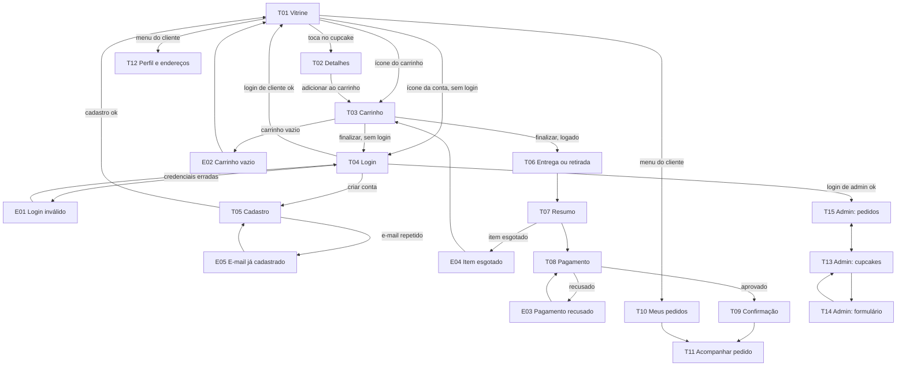
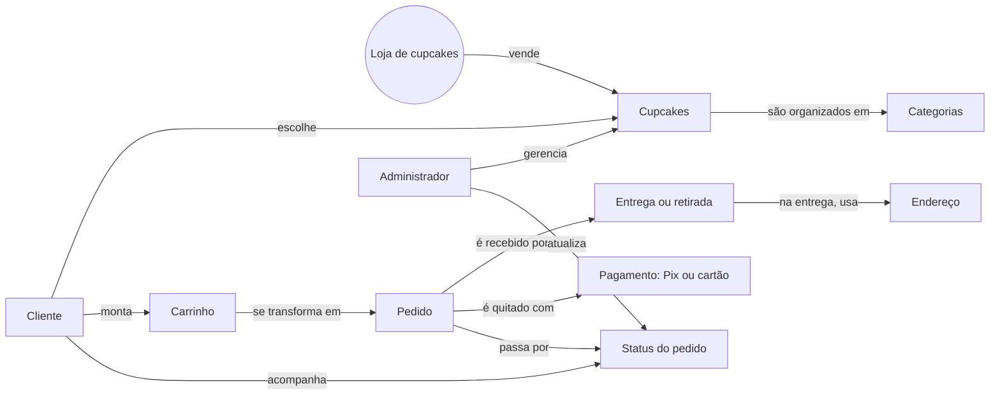

# Interface (IHC): telas, mapa navegacional e mapa conceitual

**Projeto Integrador Transdisciplinar em Engenharia de Software II**
Os wireframes estão em `docs/wireframes.html` e o **protótipo clicável** (navegação entre as telas) em `docs/prototipo.html`. Ambos abrem no navegador. Nome provisório da loja: **Doce Mimo Cupcakes**.

---

## 1. Lista de telas

| ID | Tela | Histórias | Observações de IHC |
|---|---|---|---|
| T01 | Vitrine | US-04, US-05 | Cupcake sem estoque aparece "Esgotado" e sem botão de compra |
| T02 | Detalhes do cupcake | US-06, US-07 | Mostra alergênicos; quantidade de 1 a 20 |
| T03 | Carrinho | US-07, US-08, US-10 | Subtotal recalculado a cada mudança; ✕ remove o item |
| T04 | Login | US-02 | Erro de credenciais em mensagem clara (E01) |
| T05 | Cadastro | US-01 | Indica o mínimo de 8 caracteres na senha |
| T06 | Entrega ou retirada | US-09, US-10 | Retirada não exige endereço nem cobra taxa |
| T07 | Resumo do pedido | US-10, US-11 | Mostra subtotal, taxa e total antes de pagar |
| T08 | Pagamento | US-12 | Pix (código simulado) ou cartão |
| T09 | Confirmação | US-13 | Número do pedido e resumo |
| T10 | Meus pedidos | US-15 | Do mais recente ao mais antigo |
| T11 | Acompanhar pedido | US-14 | Botão de cancelar só antes de "Em preparo" |
| T12 | Perfil e endereços | US-03 | Vários endereços por cliente |
| T13 | Admin: cupcakes | US-16 | Desativar em vez de apagar |
| T14 | Admin: formulário de cupcake | US-16 | Valida preço maior que zero |
| T15 | Admin: pedidos | US-17 | Filtro por status e atualização direta |
| E01 | Erro: login inválido | US-02 | "E-mail ou senha inválidos" |
| E02 | Erro: carrinho vazio | US-08 | Oferece o caminho de volta à vitrine |
| E03 | Erro: pagamento recusado | US-12 | Permite tentar de novo |
| E04 | Erro: item esgotado | US-11 | Diz qual item e o que fazer |
| E05 | Erro: e-mail já cadastrado | US-01 | Sugere entrar na conta |

**Princípios de IHC aplicados:** interface clara e consistente (mesmo cabeçalho em todas as telas), feedback imediato (mensagens de erro e sucesso), ações reversíveis (remover do carrinho, cancelar pedido) e simplicidade (uma tarefa principal por tela).

---

## 2. Mapa navegacional

Regra de navegação: todas as telas voltam à Vitrine (T01) pelo logotipo, e as telas de erro sempre têm um caminho de volta.

---

## 3. Mapa conceitual

