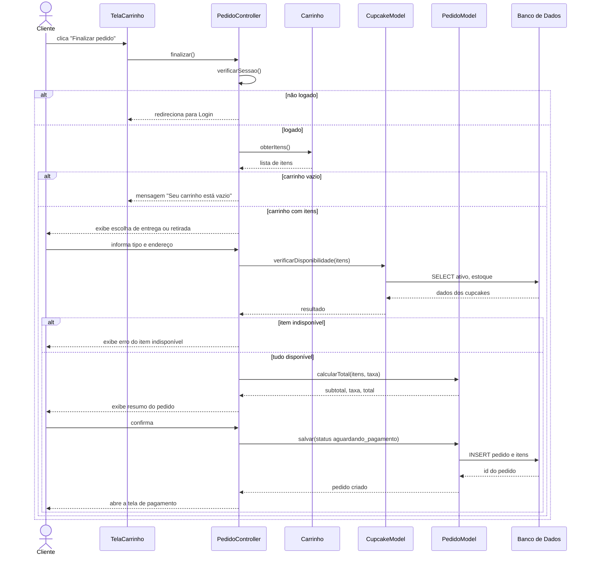
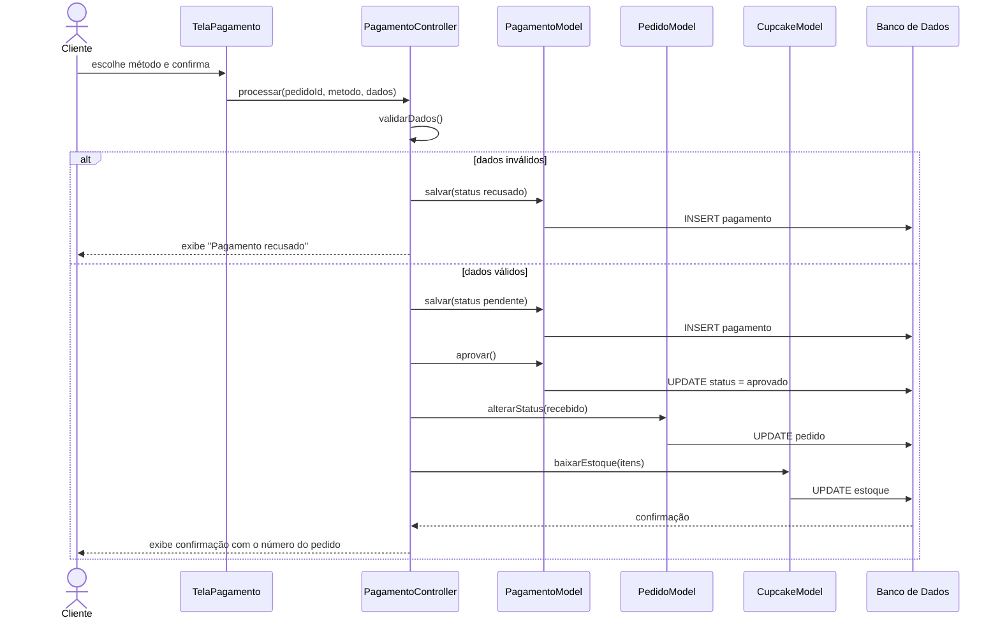
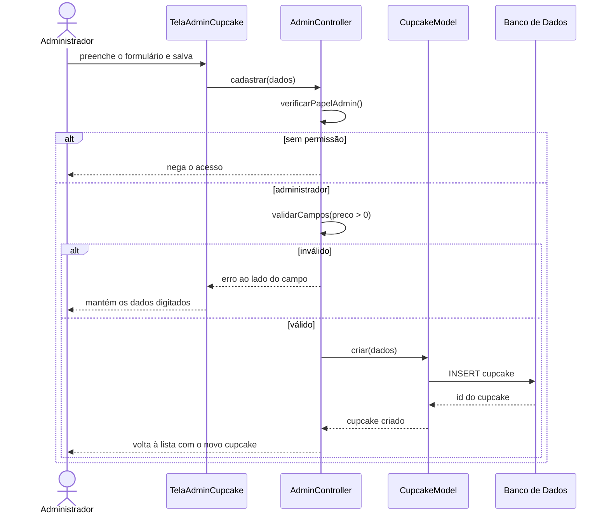
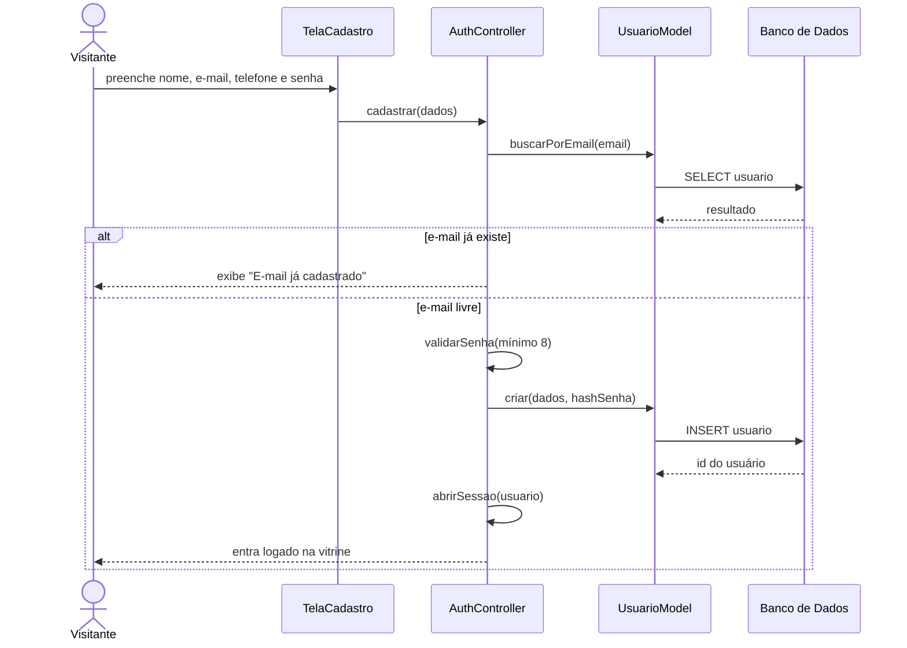

# Casos de uso expandidos e diagramas de sequência

**Projeto Integrador Transdisciplinar em Engenharia de Software II**
Completa os artefatos UML iniciados em `02-tarefas-e-casos-de-uso.md`.

---

## 1. Casos de uso expandidos

### CU-01: Finalizar pedido

- **Identificador:** #CU01
- **Descrição:** o cliente transforma o conteúdo do carrinho em um pedido, escolhendo entrega ou retirada.
- **Ator principal:** Cliente
- **Pré-condições:** o cliente está logado e tem ao menos um item no carrinho.
- **Pós-condições:** o pedido é gravado com status `aguardando_pagamento` e o cliente segue para o pagamento.
- **Histórias relacionadas:** US-09, US-10, US-11

**Curso básico de ação**

| # | Ação |
|---|---|
| 1 | O caso de uso começa quando o cliente clica em "Finalizar pedido" na TELA T03 (Carrinho) |
| 2 | O sistema verifica se o cliente está logado, conforme RN05. `<Curso Alternativo Alfa>` |
| 3 | O sistema verifica se o carrinho tem ao menos um item, conforme RN04. `<Curso Alternativo Beta>` |
| 4 | O sistema exibe a TELA T06 (Entrega ou retirada) |
| 5 | O cliente escolhe "Entrega" e seleciona um endereço salvo. `<Curso Alternativo Gama: retirada>` |
| 6 | O sistema busca a taxa de entrega na tabela de configuração, conforme RN06 |
| 7 | O sistema calcula o subtotal (soma de quantidade × preço de cada item) e o total (subtotal + taxa) |
| 8 | O sistema confere se todos os itens continuam ativos e com estoque, conforme RN10. `<Curso Alternativo Delta>` |
| 9 | O sistema exibe a TELA T07 (Resumo) com itens, subtotal, taxa, total e forma de recebimento |
| 10 | O cliente confirma o resumo |
| 11 | O sistema grava o pedido com status `aguardando_pagamento` e grava os itens com o preço do momento da compra |
| 12 | O caso de uso termina quando o sistema encaminha o cliente à TELA T08 (Pagamento) |

**Cursos alternativos**

- **Alfa (cliente não logado):** Alfa2: o sistema identifica que não há sessão ativa. Alfa3: o sistema guarda o carrinho e exibe a TELA T04 (Login). Alfa4: após o login, o caso de uso volta para a linha 3.
- **Beta (carrinho vazio):** Beta3: o sistema identifica o carrinho vazio. Beta4: o sistema exibe a TELA E02 com a mensagem "Seu carrinho está vazio". Beta5: o caso de uso termina.
- **Gama (retirada na loja):** Gama5: o cliente escolhe "Retirada". Gama6: o sistema define a taxa de entrega como R$ 0,00 e não exige endereço, conforme RN06. Gama7: o caso de uso continua na linha 7.
- **Delta (item indisponível):** Delta8: o sistema identifica um item desativado ou sem estoque. Delta9: o sistema exibe a TELA E04 informando qual item ficou indisponível. Delta10: o cliente é encaminhado à TELA T03 para ajustar o carrinho. Delta11: o caso de uso termina.

---

### CU-02: Pagar pedido

- **Identificador:** #CU02
- **Descrição:** o cliente paga o pedido por Pix ou cartão (pagamento simulado nesta versão).
- **Ator principal:** Cliente
- **Pré-condições:** existe um pedido com status `aguardando_pagamento` pertencente ao cliente.
- **Pós-condições:** com a aprovação, o pagamento fica `aprovado`, o pedido passa a `recebido` e o estoque é baixado.
- **Histórias relacionadas:** US-12, US-13

**Curso básico de ação**

| # | Ação |
|---|---|
| 1 | O caso de uso começa quando o sistema exibe a TELA T08 (Pagamento) |
| 2 | O sistema mostra o valor total do pedido |
| 3 | O cliente escolhe o método "Cartão". `<Curso Alternativo Alfa: Pix>` |
| 4 | O cliente informa número, validade e código de segurança |
| 5 | O sistema valida o formato dos dados. `<Curso Alternativo Beta>` |
| 6 | O sistema grava o pagamento como `pendente`, guardando apenas os 4 últimos dígitos do cartão, conforme RNF05 |
| 7 | O sistema processa a cobrança simulada e marca o pagamento como `aprovado` |
| 8 | O sistema altera o status do pedido para `recebido`, conforme RN07 |
| 9 | O sistema baixa o estoque de cada cupcake do pedido |
| 10 | O caso de uso termina quando o sistema exibe a TELA T09 (Confirmação) com o número do pedido |

**Cursos alternativos**

- **Alfa (Pix):** Alfa3: o cliente escolhe "Pix". Alfa4: o sistema gera um código Pix simulado e grava o pagamento como `pendente`. Alfa5: o cliente confirma que pagou. Alfa6: o caso de uso continua na linha 7.
- **Beta (dados inválidos ou recusa):** Beta5: o sistema identifica dados inválidos ou a cobrança é recusada. Beta6: o sistema grava o pagamento como `recusado` e mantém o pedido em `aguardando_pagamento`. Beta7: o sistema exibe a TELA E03 com a mensagem de recusa. Beta8: o caso de uso volta para a linha 3.

---

### CU-03: Atualizar status do pedido

- **Identificador:** #CU03
- **Descrição:** o administrador avança o pedido pelas etapas de produção e entrega.
- **Ator principal:** Administrador
- **Pré-condições:** o administrador está logado e existe pedido com status diferente de `entregue` ou `cancelado`.
- **Pós-condições:** o novo status fica gravado e visível ao cliente.
- **Histórias relacionadas:** US-17, US-14

**Curso básico de ação**

| # | Ação |
|---|---|
| 1 | O caso de uso começa quando o administrador abre a TELA T15 (Admin: pedidos) |
| 2 | O sistema verifica o papel `admin` do usuário. `<Curso Alternativo Alfa>` |
| 3 | O sistema exibe os pedidos com cliente, itens, total e status, do mais novo para o mais antigo |
| 4 | O administrador escolhe um pedido e seleciona o próximo status |
| 5 | O sistema valida a transição conforme RN08. `<Curso Alternativo Beta>` |
| 6 | O sistema grava o novo status e a data de atualização |
| 7 | O caso de uso termina quando o sistema confirma a alteração na tela |

**Cursos alternativos**

- **Alfa (usuário sem permissão):** Alfa2: o sistema identifica papel diferente de `admin`. Alfa3: o sistema nega o acesso e exibe a TELA T01. Alfa4: o caso de uso termina.
- **Beta (transição inválida):** Beta5: o sistema identifica que o pedido está `entregue` ou `cancelado`, ou que a etapa escolhida não é a seguinte. Beta6: o sistema exibe a mensagem "Transição de status não permitida". Beta7: o caso de uso volta para a linha 3.

---

### CU-04: Cadastrar cupcake

- **Identificador:** #CU04
- **Descrição:** o administrador inclui um novo cupcake na vitrine.
- **Ator principal:** Administrador
- **Pré-condições:** o administrador está logado e existe ao menos uma categoria cadastrada.
- **Pós-condições:** o cupcake é gravado como ativo e aparece na vitrine.
- **Histórias relacionadas:** US-16

**Curso básico de ação**

| # | Ação |
|---|---|
| 1 | O caso de uso começa quando o administrador clica em "+ Novo cupcake" na TELA T13 |
| 2 | O sistema exibe a TELA T14 com o formulário em branco |
| 3 | O administrador preenche nome, descrição, ingredientes, alergênicos, preço, estoque, categoria e endereço da foto |
| 4 | O administrador clica em "Salvar" |
| 5 | O sistema valida os campos obrigatórios e o preço maior que zero, conforme RN03. `<Curso Alternativo Alfa>` |
| 6 | O sistema grava o cupcake com `ativo = verdadeiro` |
| 7 | O caso de uso termina quando o sistema volta à TELA T13 com o novo cupcake na lista |

**Cursos alternativos**

- **Alfa (dados inválidos):** Alfa5: o sistema identifica campo obrigatório vazio ou preço menor ou igual a zero. Alfa6: o sistema exibe a mensagem de erro ao lado do campo e mantém o que já foi digitado, conforme RNF04. Alfa7: o caso de uso volta para a linha 3.

---

## 2. Diagramas de sequência

### DS-01: Finalizar pedido (CU-01)

### DS-02: Pagar pedido (CU-02)

### DS-03: Cadastrar cupcake (CU-04)

### DS-04: Cadastro e login (US-01, US-02)

